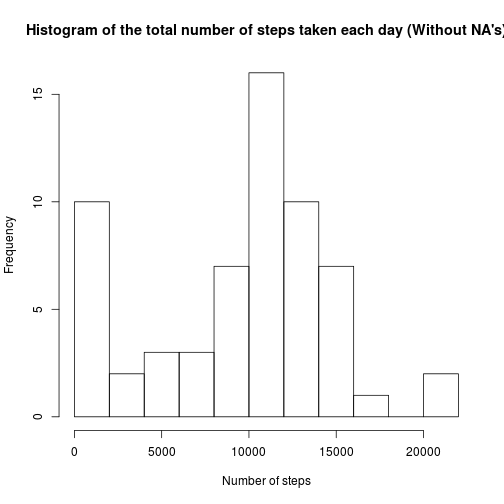
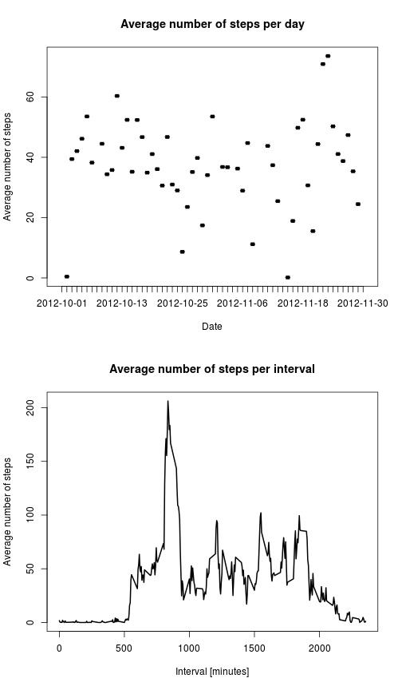
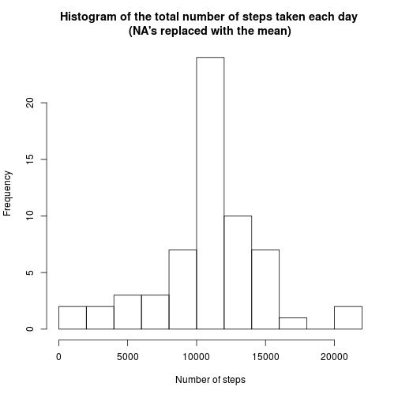
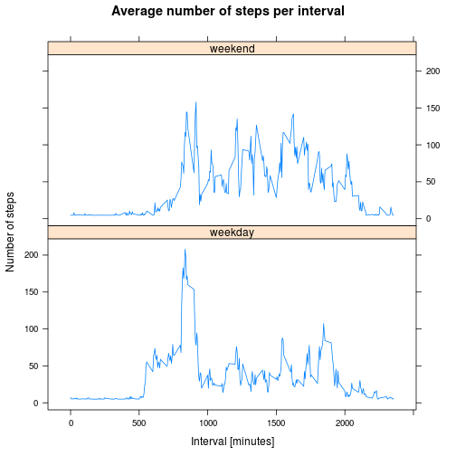

Peer graded assignment: Course Project 1
========================================

### Author: Daniel Ruiz Riquelme
### Date: 4/8/2016

### Coursera: Reproducible Research

1. Code for reading in the dataset and/or processing the data


```r
dataActivity <- read.csv("activity.csv", header=T, sep=",")

summary(dataActivity)
```

```
##      steps                date          interval     
##  Min.   :  0.00   2012-10-01:  288   Min.   :   0.0  
##  1st Qu.:  0.00   2012-10-02:  288   1st Qu.: 588.8  
##  Median :  0.00   2012-10-03:  288   Median :1177.5  
##  Mean   : 37.38   2012-10-04:  288   Mean   :1177.5  
##  3rd Qu.: 12.00   2012-10-05:  288   3rd Qu.:1766.2  
##  Max.   :806.00   2012-10-06:  288   Max.   :2355.0  
##  NA's   :2304     (Other)   :15840
```

2. Histogram of the total number of steps taken each day


```r
dataTotal <- aggregate(dataActivity$steps, by=list(dataActivity$date),FUN=sum,na.rm=TRUE)
names(dataTotal) <- c("date","total")
hist(dataTotal$total,
     breaks = 10,
     xlab="Number of steps", 
     main="Histogram of the total number of steps taken each day (Without NA's)")
```



3. Mean and median number of steps taken each day


```r
mean(dataTotal$total)
```

```
## [1] 9354.23
```

```r
median(dataTotal$total)
```

```
## [1] 10395
```

4. Time series plot of the average number of steps taken


```r
dataMean <- aggregate(dataActivity$steps, by=list(dataActivity$date),FUN=mean,na.rm=TRUE)
names(dataMean) <- c("dates", "mean")
par(mfcol = c(2, 1))

plot(y = dataMean$mean,
     x = dataMean$date,
     type="l", 
     lwd=2,  
     xlab="Date", 
     ylab="Average number of steps", 
     main="Average number of steps per day")

dataAverage <- aggregate(dataActivity$steps, by=list(dataActivity$interval),FUN=mean,na.rm=TRUE)
names(dataAverage) <- c("interval", "average")

plot(y = dataAverage$average,
     x = dataAverage$interval,
     type="l", 
     lwd=2,  
     xlab="Interval [minutes]", 
     ylab="Average number of steps", 
     main="Average number of steps per interval")
```



5. The 5-minute interval that, on average, contains the maximum number of steps


```r
dataAverage[which.max(dataAverage$average),]
```

```
##     interval  average
## 104      835 206.1698
```

6. Code to describe and show a strategy for imputing missing data

Total number of missing values

```r
sum(is.na(dataActivity$steps))
```

```
## [1] 2304
```

Index of non missing values

```r
index <- which(is.na(dataActivity$steps))
```

Calculate mean value for those values non Na

```r
meanSteps <- mean(dataActivity$steps, na.rm=TRUE)
```

Replace missing values with the mean value

```r
dataActivity$steps[index]=meanSteps
summary(dataActivity)
```

```
##      steps                date          interval     
##  Min.   :  0.00   2012-10-01:  288   Min.   :   0.0  
##  1st Qu.:  0.00   2012-10-02:  288   1st Qu.: 588.8  
##  Median :  0.00   2012-10-03:  288   Median :1177.5  
##  Mean   : 37.38   2012-10-04:  288   Mean   :1177.5  
##  3rd Qu.: 37.38   2012-10-05:  288   3rd Qu.:1766.2  
##  Max.   :806.00   2012-10-06:  288   Max.   :2355.0  
##                   (Other)   :15840
```

7. Histogram of the total number of steps taken each day after missing values are imputed


```r
dataTotal <- aggregate(dataActivity$steps, by=list(dataActivity$date),FUN=sum)
names(dataTotal) <- c("date","total")
hist(dataTotal$total,
     breaks = 10,
     xlab="Number of steps", 
     main="Histogram of the total number of steps taken each day \n(NA's replaced with the mean)")
```



8. Panel plot comparing the average number of steps taken per 5-minute interval across weekdays and weekends

Creating a column in the data set to differenciate between weekdays and weekends

```r
Sys.setlocale("LC_TIME", "C")
```

```
## [1] "C"
```

```r
dataActivity$weekdays <- tolower(weekdays(as.Date(dataActivity$date)))
dataActivity$weekday_end <- ifelse(dataActivity$weekdays=="saturday"|dataActivity$weekdays == "sunday", "weekend","weekday")
```

Computing the mean data

```r
dataMeanWeekday <- aggregate(dataActivity$steps,
                             by=list(dataActivity$weekday_end, 
                                     dataActivity$interval),
                             mean
                             )
names(dataMeanWeekday) <- c("weekday_end", "interval", "steps")
```

Plotting

```r
library(lattice)
xyplot(dataMeanWeekday$steps ~ dataMeanWeekday$interval |dataMeanWeekday$weekday_end,
       layout = c(1,2), 
       type = "l", 
       ylab = "Number of steps", 
       xlab = "Interval [minutes]",
       main = "Average number of steps per interval")
```



